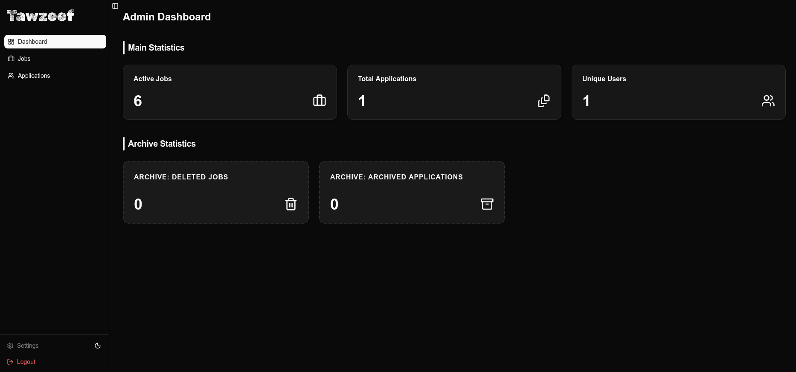
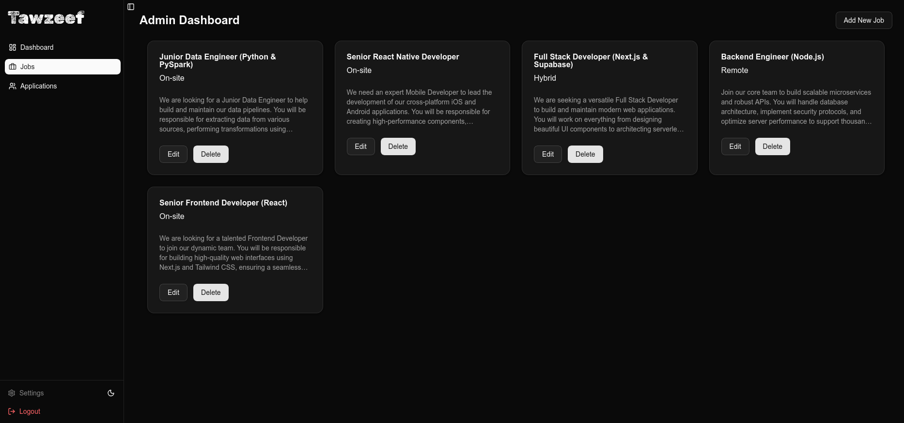
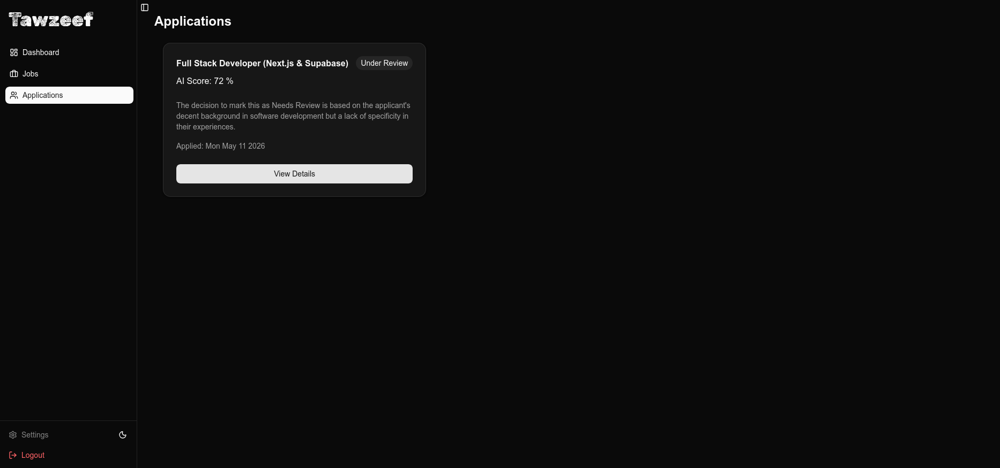
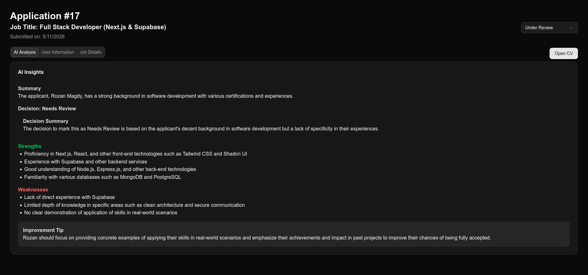

### **Project Title & Description:**
**Tawzeef** is a high-performance recruitment ecosystem that automates candidate screening using Large Language Models (LLMs). It parses resumes, extracts key skills, and provides data-driven hiring recommendations.

### [**Live Demo on Vercel**](https://tawzeef-deployment.vercel.app/)

### **Core Framework & Styling**
* **Next.js 16 (App Router)** & **TypeScript**.
* **Tailwind CSS v4** (OKLCH Color System) & **Shadcn/ui**.

### **AI & Document Processing**
* **Groq SDK** - For ultra-fast inference using high-performance LLMs.
* **PDF2JSON** - For server-side parsing and data extraction from PDF resumes.

### **Database & Storage**
* **Drizzle ORM** (Primary) with **Turso (libSQL)** for edge-ready relational data.
* **MongoDB (Mongoose)** - Specifically for storing complex AI **Analysis** models and feedback logs.
* **Cloudinary SDK** - Professional media management for resume storage and retrieval.

### **Auth & Middleware**
* **NextAuth.js (Auth.js)** - Secure, scalable authentication handling.

### **Key Features:**
* **Automated Screening:** Uses **Groq** to analyze resumes against job descriptions in milliseconds.
* **Deep PDF Parsing:** Converts raw PDF data into structured JSON for precise AI matching.
* **Cloud Media Management:** Integrated with **Cloudinary** for secure and fast CV hosting.
* **Hybrid Storage:** Combines the speed of **SQL (Turso)** for relations and the flexibility of **NoSQL (MongoDB)** for AI insights.

### **Screenshots:**

  
  
  
  

